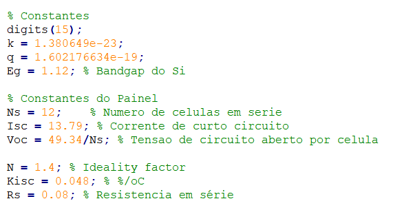

# MPPT_Matlab
   Script utlizado para simular as características de tensão, corrente e potência de uma célula fotovoltaica e, por fim descobrir o ponto de tensão que gera a máxima potência da célula. Parte de uma pesquisa feita na Faculdade Engenheiro Salvador Arena sob a disciplina de Cálculo Numérico.
  
# Quick Start
```Matlab Console
> MPPT_MATLAB

ans:

    A resposta encontrada é 45,250536015760602V, com um erro de 0,000000000902219W
```

# Configuração
  É possível configurar o programa para simular paineis com parâmetros diferentes. Todas as constantes do painel podem ser obtidas pelo seu datasheet.



# Autores
- AÍMOLA, H.
- BAGLIONE, G.
- DE OLIVEIRA, G.
- RADES, H.

